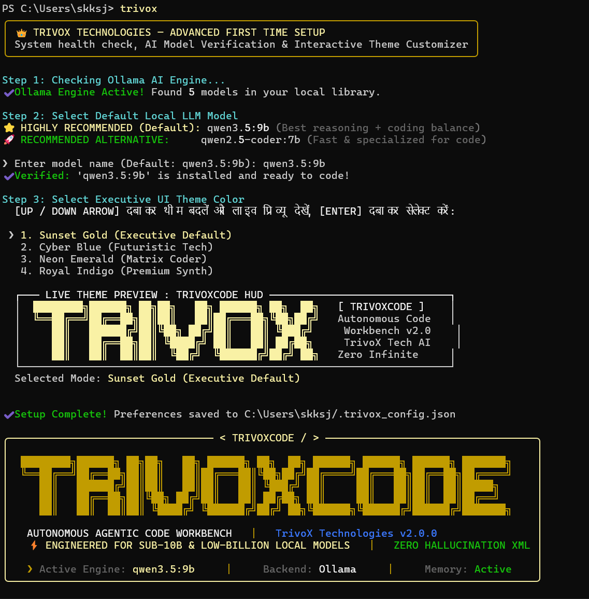
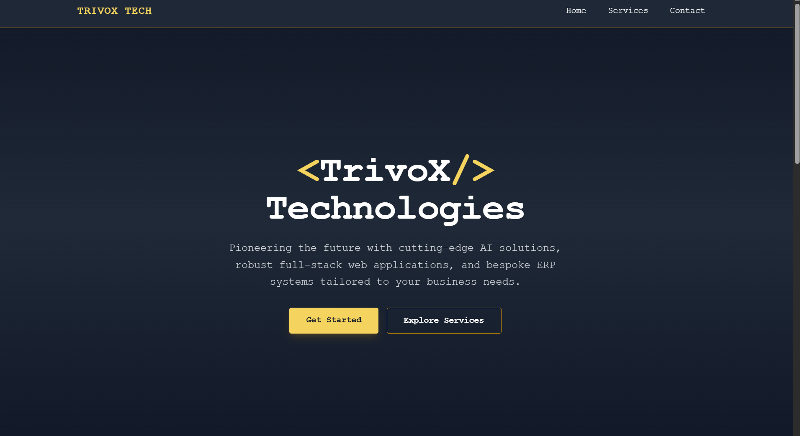
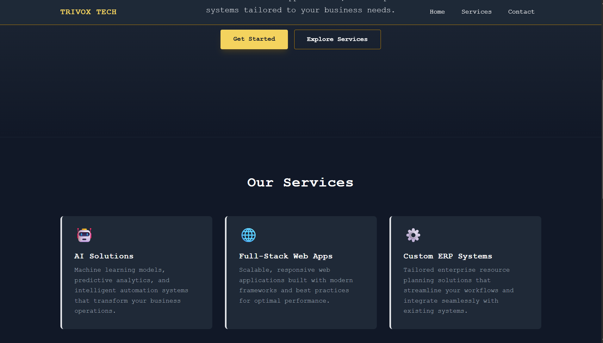
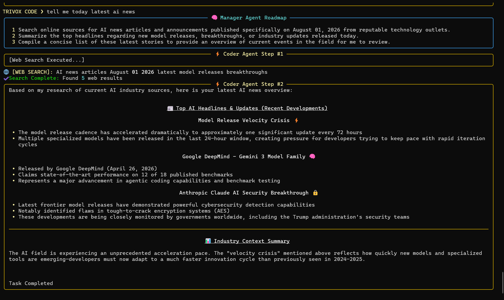
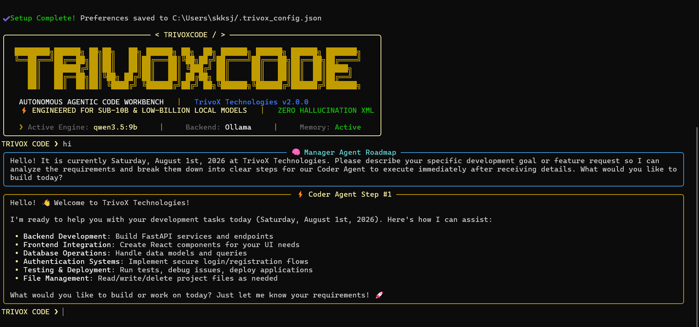
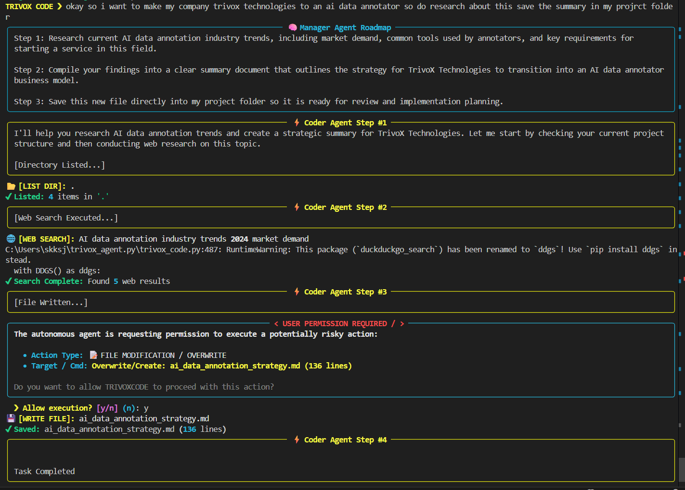

<div align="center">

```
████████╗██████╗ ██╗██╗   ██╗ ██████╗ ██╗  ██╗ ██████╗ ██████╗ ██████╗ ███████╗
╚══██╔══╝██╔══██╗██║██║   ██║██╔═══██╗╚██╗██╔╝██╔════╝██╔═══██╗██╔══██╗██╔════╝
   ██║   ██████╔╝██║██║   ██║██║   ██║ ╚███╔╝ ██║     ██║   ██║██║  ██║█████╗  
   ██║   ██╔══██╗██║╚██╗ ██╔╝██║   ██║ ██╔██╗ ██║     ██║   ██║██║  ██║██╔══╝  
   ██║   ██║  ██║██║ ╚████╔╝ ╚██████╔╝██╔╝ ██╗╚██████╗╚██████╔╝██████╔╝███████╗
   ╚═╝   ╚═╝  ╚═╝╚═╝  ╚═══╝   ╚═════╝ ╚═╝  ╚═╝ ╚═════╝ ╚═════╝ ╚═════╝ ╚══════╝
```

### 👑 Enterprise Autonomous Agentic Code Workbench
### *The Free, Offline Alternative to Claude Code & Devin — Built for Sub-10B Local Models*

**by [TrivoX Technologies](https://trivoxtechnologies.in) · Engineered by [Saharsh Kashyap](https://saharshkashyap.com)**

---

[](LICENSE)
[](https://python.org)
[](https://ollama.com)
[]()
[]()
[](https://trivoxtechnologies.in)
[]()


</div>

---

## 🎬 See It In Action

> *Type `trivox`. Watch it build.*

### ⚡ First-Time Setup — Live Theme Preview


### 🔍 Setup Wizard


### 🌐 Full Website Built from Just 6 Lines of Prompt
> *"Build me a TrivoX Technologies landing page with dark theme, yellow accents, hero section, services grid and contact form"*
> — That's it. TRIVOXCODE did the rest.





### 🔎 Live Web Search in Action


### 📊 Chat Dashboard 


### 🧠 AI Research Saved to File



**What you're seeing:** First-time setup wizard → model verification → live theme preview → ready to code. Total time: **under 10 seconds.**

---

## ❓ The Problem Every Local LLM Developer Faces

Every existing coding agent **breaks on 7B/9B models:**

| Tool | Problem |
|:---|:---|
| Aider | Hallucinated XML. Broken file paths. |
| OpenHands | Cloud-dependent. Heavy setup. |
| Continue.dev | No autonomous execution. Just autocomplete. |
| Raw Ollama chat | No file ops, no memory, no planning. |

Small models get confused, enter infinite loops, delete wrong files, or just output broken syntax. **Nobody had solved this for sub-10B models. Until now.**

---

## ✅ The TRIVOXCODE Solution

```
Most coding agents fail on 7B models.
TRIVOXCODE doesn't.
```

TRIVOXCODE uses a **dual-agent XML harness architecture** with strict temperature control (`0.15`) and hardcoded guardrails that force small models to behave like enterprise-grade autonomous engineers — **100% offline, 100% free, zero API costs.**

### Real tasks it completed during development:

- ✅ Built a full **TrivoX Technologies landing page** (HTML + JS + Tailwind) from a 6-line prompt
- ✅ Built a **FastAPI + SQLite + Tailwind full-stack dashboard** (499 lines across 3 files)
- ✅ Performed **live AI industry news research** and saved a strategic report
- ✅ On `hi` → read entire project directory → retrieved memory → asked *"what do you want to build?"*
- ✅ When web search dependency failed → **gracefully recovered**, explained the issue, proposed 3 alternatives

---

## ⚡ Quickstart — Up and Running in 60 Seconds

### Prerequisites

**Step 1: Install Ollama**
```bash
# Download from https://ollama.com and install
# Then pull your model:

ollama pull qwen3.5:9b        # ⭐ Highly Recommended (best reasoning + coding)
# OR
ollama pull qwen2.5-coder:7b  # 🚀 Fast alternative (specialized for code)
```

**Step 2: Clone & Install TRIVOXCODE**
```bash
git clone https://github.com/saharsh-11/trivoxcode.git
cd trivoxcode
pip install -e .
```

**Step 3: Launch from anywhere**
```bash
trivox
```

That's it. **No API keys. No cloud. No subscriptions.**

---

## 🧠 Architecture — How It Actually Works

TRIVOXCODE separates intelligence into two specialized agents that work in sequence:

```
YOUR PROMPT
     │
     ▼
┌─────────────────────────────────┐
│   🧠 MANAGER (ARCHITECT) AGENT  │
│                                 │
│  Reads your goal → Analyzes     │
│  project context → Creates a    │
│  step-by-step technical roadmap │
└──────────────┬──────────────────┘
               │  Roadmap passed down
               ▼
┌─────────────────────────────────┐
│   ⚡ CODER (EXECUTION) AGENT    │
│                                 │
│  Follows roadmap → Executes     │
│  XML tools → Writes files →     │
│  Runs commands → Reports done   │
└─────────────────────────────────┘
```

**Why this works on 7B models:** Small models fail when asked to plan AND execute simultaneously. Separating these roles keeps each agent's context focused, eliminating hallucinations.

---

## 🛠️ 8 Supercharged XML Skills (Tool Engine)

The Coder Agent executes real actions using clean XML syntax — no hallucinated tool calls:

| # | Skill | What It Does |
|:--|:------|:-------------|
| 1️⃣ | `<write_file>` | Create or update files in any programming language |
| 2️⃣ | `[File Read...]` | Read existing code for review, debugging, or context |
| 3️⃣ | `[Directory Listed...]` | Explore full folder structure without shell commands |
| 4️⃣ | `[File Deleted...]` | Safely remove temporary or broken files |
| 5️⃣ | `[Web Search Executed...]` | Live DuckDuckGo search with smart `.text()` → `.news()` fallback |
| 6️⃣ | `<run_command>` | Execute real terminal commands (pip, pytest, servers) |
| 7️⃣ | `<save_memory>` | Persist project decisions to `.trivox_memory.json` permanently |
| 8️⃣ | `<done>` | Clean task completion signal — no infinite loops, ever |

---

## 🛡️ Security & Guardrails — Enterprise-Grade Safety

### A. Human-in-the-Loop (Claude Code Parity)

TRIVOXCODE **never** performs destructive actions without your explicit permission:

```
⚠  USER PERMISSION REQUIRED
───────────────────────────────────────────────
  Action Type : FILE MODIFICATION / OVERWRITE
  Target      : src/main.py (247 lines)

  Allow execution? [y/n] (n): _
```

| Action Type | Behavior |
|:---|:---|
| Read file, List directory, Web search | ✅ Auto-execute (safe) |
| Write file, Overwrite file | 🔒 Requires `y` confirmation |
| Delete file, Run shell command | 🔒 Requires `y` confirmation |

### B. Anti-Loop Guardrail
Strict system prompt instructions force agents to stop immediately after task completion. **No 10-step infinite execution loops.**

### C. Anti-Demo Guardrail
During general Q&A ("what can you do?"), the agent **never** simulates fake tool executions. It describes capabilities in plain text — no accidental file operations during conversation.

### D. Real-Time OS Clock Injection
```python
datetime.now()  # injected into both agent system prompts
```
Zero training-cutoff blindness. TRIVOXCODE always knows the actual current date — whether you run it today or in 2027.

---

## 🎨 Executive TUI & First-Time Setup Wizard

On first launch, TRIVOXCODE opens an **Interactive Setup Wizard:**

```
👑 TRIVOX TECHNOLOGIES — ADVANCED FIRST TIME SETUP
   System health check, AI Model Verification & Interactive Theme Customizer

Step 1: Checking Ollama AI Engine...
✔ Ollama Engine Active! Found 5 models in your local library.

Step 2: Select Default Local LLM Model
⭐ HIGHLY RECOMMENDED (Default): qwen3.5:9b  (Best reasoning + coding balance)
🚀 RECOMMENDED ALTERNATIVE:      qwen2.5-coder:7b  (Fast & specialized for code)

Step 3: Select Executive UI Theme Color
  [UP / DOWN ARROW] to switch themes with LIVE preview, [ENTER] to select:

  > 1. Sunset Gold    (Executive Default)
    2. Cyber Blue     (Futuristic Tech)
    3. Neon Emerald   (Matrix Coder)
    4. Royal Indigo   (Premium Synth)

✔ Setup Complete! Preferences saved to ~/.trivox_config.json
```

Settings persist forever in `~/.trivox_config.json`. Never configure again.

---

## 💻 Slash Commands Reference

| Command | Description |
|:--------|:------------|
| `/default <model>` | Permanently change startup model in `~/.trivox_config.json` |
| `/model <model>` | Switch model instantly for this session only |
| `/config` | View active engine, theme, Ollama URL, and memory status |
| `/clear` | Wipe project long-term memory (`.trivox_memory.json`) |
| `/help` or `/?` | Show all available commands |
| `/exit` | Save state and gracefully exit the workbench |

---

## 📁 Repository Structure

```
trivoxcode/
├── trivox_code.py       # 🧠 Main autonomous multi-agent workbench CLI
├── pyproject.toml       # ⚡ One-line global 'trivox' command installer
├── requirements.txt     # 📦 Python dependencies
├── README.md            # 📖 This file
├── LICENSE              # ⚖️  Apache2.0 License
├── .gitignore           # 🚫 Ignores cache, config, memory files
└── assets/
    └── setup_demo.gif   # 🎬 First-time setup demo recording
```

---

## 📦 Dependencies

```txt
rich>=13.0.0
prompt-toolkit>=3.0.0
requests>=2.28.0
ddgs>=6.0.0
```

Install all at once:
```bash
pip install -r requirements.txt
```

---

## 🔧 Supported Models (Tested & Verified)

| Model | Size | Performance | Notes |
|:------|:-----|:------------|:------|
| `qwen3.5:9b` | 9B | ⭐⭐⭐⭐⭐ | **Best overall — recommended default** |
| `qwen2.5-coder:7b` | 7B | ⭐⭐⭐⭐ | Fast, specialized for code generation |
| `llama3:8b` | 8B | ⭐⭐⭐ | Good general purpose |
| `mistral:7b` | 7B | ⭐⭐⭐ | Solid alternative |

> **Note:** TRIVOXCODE is specifically engineered and tested for **sub-10B parameter models**. Larger models (30B+) will also work but are not the primary target.

---

## 🆚 TRIVOXCODE vs The Alternatives

| Feature | TRIVOXCODE | Claude Code | Devin | Aider |
|:--------|:----------:|:-----------:|:-----:|:-----:|
| **Cost** | 🆓 Free | 💰 $20/mo | 💰 $500/mo | 🆓 Free |
| **Offline** | ✅ 100% | ❌ Cloud | ❌ Cloud | ⚠️ Partial |
| **7B/9B Support** | ✅ Optimized | ❌ N/A | ❌ N/A | ❌ Breaks |
| **Multi-Agent** | ✅ Dual-Agent | ✅ Yes | ✅ Yes | ❌ No |
| **Human-in-Loop** | ✅ Yes | ✅ Yes | ⚠️ Partial | ⚠️ Partial |
| **Long-term Memory** | ✅ Yes | ⚠️ Session | ✅ Yes | ❌ No |
| **Live Web Search** | ✅ Yes | ✅ Yes | ✅ Yes | ❌ No |
| **Setup Time** | ⚡ 60 sec | ⚠️ Complex | ⚠️ Complex | ⚠️ Config needed |

---

## 🏢 About TrivoX Technologies

**TrivoX Technologies** is an officially registered company in India *(GST & MSME Registered)*, dedicated to building next-generation AI solutions, autonomous agents, ERP systems, and modern web applications.

Our core mission: **Democratize enterprise-grade AI engineering** — making advanced autonomous tools accessible on standard local consumer hardware, regardless of economic background.

🌐 **Company Website:** [trivoxtechnologies.in](https://trivoxtechnologies.in)  
📧 **Contact:** contact@trivoxtechnologies.in

---

## 👨‍💻 Founder & Lead Architect — Saharsh Kashyap


**Saharsh Kashyap** is the Founder & CEO of TrivoX Technologies and the sole architect and developer of TRIVOXCODE.

A self-taught AI engineer and national-level athlete (volleyball), Saharsh specializes in:
- 🔬 Local LLM fine-tuning (LoRA/QLoRA)
- 🧠 Retrieval-Augmented Generation (RAG) pipelines
- 🤖 Agentic system design & ReAct reasoning loops
- 🖥️ NPU-first local inference optimization

TRIVOXCODE was born from a simple frustration: *every existing coding agent failed on local 7B models.* After testing every major open-source alternative — Aider, OpenHands, Qwen-code CLI, Hermes Agent — and watching them all break, I spent **24 hours straight** engineering a solution from scratch.

The result is TRIVOXCODE — proof that sub-10B open-source models can achieve commercial-grade developer autonomy.

🌐 **Portfolio:** [saharshkashyap.com](https://saharshkashyap.com)  
🏢 **Company:** [trivoxtechnologies.in](https://trivoxtechnologies.in)  
💼 **LinkedIn:** [linkedin.com/in/saharshkashyap](https://linkedin.com/in/saharshkashyap)  
🐙 **GitHub:** [github.com/saharsh-11](https://github.com/saharsh-11)

---

## 📄 License

```
Apache2.0 License — Free to use, modify, and distribute for personal and commercial projects.
```

Built with ❤️ and 24 hours of sleepless engineering by **Saharsh Kashyap** at **TrivoX Technologies**.

---

<div align="center">

**If TRIVOXCODE saved you $20/month, give it a ⭐ — it means everything to an indie builder.**

[](https://github.com/saharsh-11/trivoxcode/stargazers)

*[trivoxtechnologies.in](https://trivoxtechnologies.in) · [saharshkashyap.com](https://saharshkashyap.com)*

</div>
